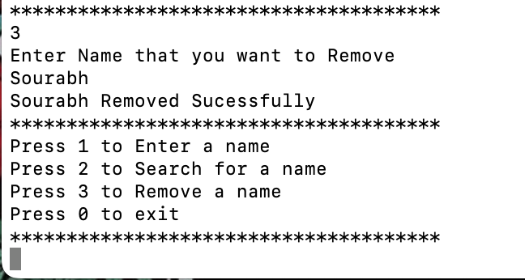
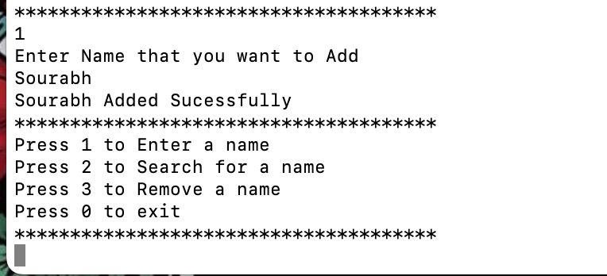
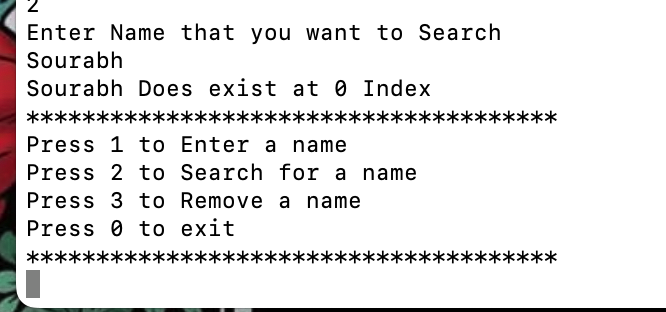

**Lab Exercise Question**  
You are supposed to create a menu-driven program that has the following menu options: 
    1. Enter a name 
    2. Search for a name 
    3. Remove a name  
**Note:** 
    1. The menu-driven program has to be made with the help of a do-while loop and switch-case statements.  
**Constraints:** 
    1. The names collected must be stored in an array with a max length of 1024. 
    2. The names in the array should be UNIQUE; no duplicate entries are expected! 
    3. Provide necessary validations that the user enters only valid names that are not going to be repeated. 
    4. Removing a name should not create empty space inside the array! 
    5. Format your results properly!! 

**Preview**

Remove 
 

Add 
 

Search 
 
